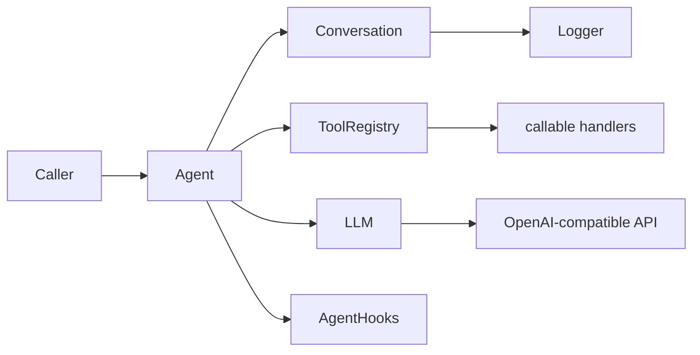
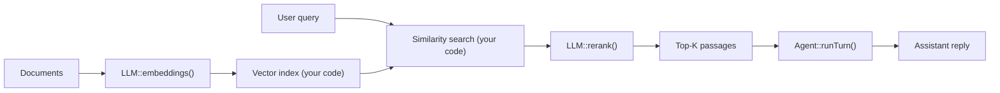

# llm-lib

PHP library for building **LLM agents** and calling **OpenAI-compatible HTTP APIs** — chat completions, embeddings, rerank, and tokenize (OpenAI, Ollama, vLLM, llama.cpp, LiteLLM, etc.).

**Namespace:** `Tivins\LlmLib`  
**Package:** `tivins/llm-lib`  
**PHP:** `^8.3`  
**Current version:** see [`composer.json`](composer.json) and [`CHANGELOG.md`](CHANGELOG.md)

---

## Table of contents

1. [What this library does](#what-this-library-does)
2. [Architecture](#architecture)
3. [Quick start](#quick-start)
4. [Core concepts](#core-concepts)
5. [Agent lifecycle hooks](#agent-lifecycle-hooks)
6. [Behavioral contracts](#behavioral-contracts)
7. [Examples](#examples)
8. [Backend compatibility](#backend-compatibility)
9. [Project layout](#project-layout)
10. [Development](#development)

---

## What this library does

| Responsibility | Class | File |
|---|---|---|
| HTTP client (`/v1/chat/completions`, `/v1/embeddings`, `/v1/rerank`, `/tokenize`) | `LLM` | `src/LLM.php` |
| Message history | `Conversation` | `src/Conversation.php` |
| Single turn: LLM ↔ tools loop | `Agent` | `src/Agent.php` |
| Tool definitions + handlers | `ToolRegistry`, `Tool`, `ToolSchema` | `src/ToolRegistry.php`, … |
| Skipped tool call payloads | `ToolCallRejection` | `src/ToolCallRejection.php` |
| Request parameters (chat) | `ChatCompletionOptions` | `src/ChatCompletionOptions.php` |
| Request parameters (embeddings) | `EmbeddingOptions` | `src/EmbeddingOptions.php` |
| Request parameters (rerank) | `RerankOptions` | `src/RerankOptions.php` |
| Chat response | `ChatCompletionResponse` | `src/ChatCompletionResponse.php` |
| Embeddings response | `EmbeddingResponse`, `Embedding` | `src/EmbeddingResponse.php`, … |
| Rerank response | `RerankResponse`, `RerankResult` | `src/RerankResponse.php`, … |
| Turn outcome | `AgentTurnResult` | `src/AgentTurnResult.php` |
| Optional JSON persistence | `Logger` | `src/Logger.php` |
| Observability / extension points | `AgentHooks` | `src/AgentHooks.php` |

**Not included:** streaming, model management endpoints (stubs exist as comments in `LLM.php`), multi-agent orchestration, vector indexing, or a built-in chat UI.

---

## Architecture

### Agent turn



**One agent turn** (`Agent::runTurn()`):

1. Dispatch `BeforeTurn`.
2. Call the LLM with the current conversation.
3. If the assistant message contains `tool_calls`, execute each tool, append tool messages, and call the LLM again.
4. Repeat until the model stops with `finish_reason: stop` (or `length` without tool calls — see [behavioral contracts](#behavioral-contracts)).
5. Store the final assistant message in the conversation.
6. Dispatch `AfterTurn` and return `AgentTurnResult`.

### RAG pipeline (typical use of embeddings + rerank)

Embeddings and rerank are **standalone** `LLM` calls — they do not go through `Agent`. A common retrieval pipeline looks like:



---

## Quick start

### Install

```bash
composer require tivins/llm-lib
```

### Minimal agent (text response)

```php
<?php

use Tivins\LlmLib\Agent;
use Tivins\LlmLib\ChatCompletionOptions;
use Tivins\LlmLib\Conversation;
use Tivins\LlmLib\LLM;
use Tivins\LlmLib\Message;
use Tivins\LlmLib\Role;
use Tivins\LlmLib\ToolRegistry;

$llm = new LLM(
    endpoint: 'http://localhost:11434',  // Ollama example
    defaultModel: 'llama3',
);

$tools = new ToolRegistry();
$agent = new Agent($llm, $tools);

$conversation = new Conversation([
    Message::withCreatedAt(Role::User, 'Hello!'),
]);

$result = $agent->runTurn($conversation, new ChatCompletionOptions(temperature: 0.3));

if ($result->success) {
    echo $result->message->content;
} else {
    echo 'Error: ' . $result->error;
}
```

### Agent with tools

```php
use Tivins\LlmLib\Tool;
use Tivins\LlmLib\ToolSchema;

$tools = new ToolRegistry(
    new Tool(
        new ToolSchema(
            name: 'get_weather',
            description: 'Get current weather for a city',
            parameters: [
                'type' => 'object',
                'properties' => [
                    'city' => ['type' => 'string'],
                ],
                'required' => ['city'],
            ],
        ),
        handler: fn (string $args): string => json_encode(['temp_c' => 22, 'city' => json_decode($args, true)['city'] ?? 'unknown']),
    ),
);

$agent = new Agent($llm, $tools, maxToolRounds: 10);
```

Handlers receive the **raw JSON arguments string** from the model and must return a **string** (usually JSON) used as the tool message `content`.

### Embeddings

```php
use Tivins\LlmLib\EmbeddingOptions;
use Tivins\LlmLib\LLM;

$llm = new LLM(
    endpoint: 'http://127.0.0.1:8081',
    defaultModel: 'bge-m3-Q8_0.gguf',
);

$response = $llm->embeddings(
    ['The cat sits on the mat.', 'A feline rests on a rug.'],
    new EmbeddingOptions(encodingFormat: 'float'),
);

foreach ($response->embeddings as $embedding) {
    echo count($embedding->vector) . " dimensions\n";
}
```

### Rerank

```php
use Tivins\LlmLib\LLM;
use Tivins\LlmLib\RerankOptions;

$llm = new LLM(
    endpoint: 'http://127.0.0.1:8082',
    defaultModel: 'Qwen3-Reranker-4B-Q4_K_M.gguf',
);

$documents = [
    'The giant panda is a bear endemic to China.',
    'Stock markets rallied after earnings.',
];

$response = $llm->rerank('What is a panda?', $documents, new RerankOptions(topN: 2));

foreach ($response->rankedDocuments($documents) as $item) {
    echo $item['relevanceScore'] . ' — ' . $item['document'] . "\n";
}
```

Use a **reranker model** on a server started with `--reranking` — do not call `/v1/embeddings` with a reranker (scores will be meaningless).

### Conversation logging

```php
use Tivins\LlmLib\Logger;

$conversation = new Conversation(
    messages: [],
    logger: new Logger('/var/log/conversations/session-1.json'),
);
// Each addMessage() (including those done by Agent) triggers a file write.
```

---

## Core concepts

### `Message`

A chat message with `role`, `content`, optional `reasoningContent`, `toolCalls`, `toolCallId`, and `meta`.

Two serialization methods exist on purpose:

| Method | Purpose |
|---|---|
| `toArray()` | Internal storage, logs, `JsonSerializable` — keeps `reasoning_content` and `meta` |
| `toChatCompletionArray()` | Payload sent to the API — omits `reasoning_content` and `meta` |

### `Conversation`

Ordered list of `Message` objects. `toChatCompletionArray()` maps every message through `Message::toChatCompletionArray()`.

### `ChatCompletionOptions`

Per-request settings: `model`, `temperature`, `topP`, `n`, `tools`, `toolChoice`, `responseFormat`.

**Important:** `Agent::runTurn()` **injects** `$options->tools = $this->tools` (mutates the object in place). Passing a different `ToolRegistry` in options throws `InvalidArgumentException`.

### `AgentTurnResult`

```php
new AgentTurnResult(
    message: ?Message,   // final assistant message when success
    success: bool,
    error: ?string,
    toolRounds: int,       // number of tool execution rounds in this turn
);
```

### `LLM`

Shared HTTP client. Endpoint is the **base URL without trailing `/v1`**; paths are appended per method.

| Method | Endpoint | Input |
|---|---|---|
| `chatCompletion()` | `POST /v1/chat/completions` | `Conversation` + `ChatCompletionOptions` |
| `embeddings()` | `POST /v1/embeddings` | `string\|list<string>` + `EmbeddingOptions` |
| `rerank()` | `POST /v1/rerank` | `query`, `list<string> documents` + `RerankOptions` |
| `tokenize()` | `POST /tokenize` | `string` (llama.cpp) |

Common behaviour:

- Optional `apiKey` → `Authorization: Bearer` header.
- Configurable `timeoutSeconds` (default 120).
- Throws `Exception` on cURL failure, HTTP ≥ 400, or malformed JSON.
- Returns `duration` in milliseconds on response objects.

**Chat-specific:** `chatCompletion()` normalizes GPT-OSS / Harmony `<|channel|>` markers in assistant responses and can recover usable text from llama.cpp Harmony parse errors (HTTP 500).

**Embeddings-specific:** vectors are returned as `float[]`. When the API returns base64-encoded vectors (`encoding_format: base64`), they are decoded automatically.

**Rerank-specific:** `RerankResponse::sortedResults()` returns results by descending score; `rankedDocuments($documents)` maps scores back to the original document strings.

### `EmbeddingOptions` / `EmbeddingResponse`

- `EmbeddingOptions`: `model`, `encodingFormat` (`float` or `base64`), `dimensions` (OpenAI embedding v3).
- `EmbeddingResponse`: `model`, `usage`, `embeddings[]`, `first()`, `vectors()`, `raw()`.
- Each `Embedding` has `index` and `vector` (`list<float>`).

### `RerankOptions` / `RerankResponse`

- `RerankOptions`: `model`, `topN` (sent as `top_n`; limits how many results the server returns).
- `RerankResponse`: `model`, `usage`, `results[]`, `sortedResults()`, `rankedDocuments()`, `raw()`.
- Each `RerankResult` has `index` (position in the input `documents` array) and `relevanceScore`.

### `ToolRegistry`

- `registerTools()` adds or **overwrites** tools by name (last registration wins).
- `execute()` runs the handler or returns a tool message with `{"error":"No handler for tool: …"}` (no exception).

---

## Agent lifecycle hooks

Register listeners on `AgentHooks` (fluent API). Events are defined in `AgentHookEvent`:

| Event | When | Notable payload |
|---|---|---|
| `BeforeTurn` | Start of `runTurn()` | `BeforeTurnEvent` |
| `AfterTurn` | End of `runTurn()` | `AfterTurnEvent` + `AgentTurnResult` |
| `BeforeLlmCall` / `AfterLlmCall` | Around each API call | `toolRound` index |
| `BeforeToolRound` / `AfterToolRound` | Around each batch of tool executions | tool calls / tool messages |
| `BeforeToolCall` / `AfterToolCall` | Per tool call | `BeforeToolCallEvent::$replacement` can skip execution |
| `OnMaxToolRoundsExceeded` | `maxToolRounds` reached | turn fails after this |
| `OnAssistantResponse` | Before storing final assistant message | `OnAssistantResponseEvent::$visibleContent` can rewrite content |

```php
$hooks = new AgentHooks();
$hooks->beforeToolCall(function (BeforeToolCallEvent $event): void {
    // Skip execution with a standard user-rejection payload:
    // $event->replacement = ToolCallRejection::userRejected($event->call);

    // Or return any canned tool message without calling the handler:
    // $event->replacement = new Message(Role::Tool, '{"mock":true}', toolCallId: $event->call->id);
});

$agent = new Agent($llm, $tools, hooks: $hooks);
```

See also [`todo_tool_approval.md`](todo_tool_approval.md) for tool-approval patterns in a code harness.

---

## Behavioral contracts

These behaviors are **intentional** and covered by unit tests. Open questions live in [`TODO.md`](TODO.md).

### Empty content

- Stored as `''` in `Message::$content` and `toArray()`.
- Sent to the API as `null` in `toChatCompletionArray()` (OpenAI format).

### `reasoning_content`

- Parsed from API responses and kept in `Message::$reasoningContent`.
- Included in `toArray()` for logging.
- **Never** sent back in subsequent requests via `toChatCompletionArray()`.

### Unknown tool

No handler → tool message with JSON error content; conversation continues (model may recover).

### Duplicate tool name

`registerTools()` silently overwrites the previous handler for the same name.

### `finish_reason: length`

If the model stops due to token limit **without** pending tool calls, the turn is treated as **success** (truncated content is stored). Check `message->meta['finish_reason']` if you need to detect truncation.

### Assistant message metadata

Stored assistant messages include `meta` with at least `created_at`, `time_ms`, `model`, `usage`, `finish_reason`, and `temperature` (from options).

---

## Examples

Runnable scripts in [`examples/`](examples/). Numbering leaves gaps (`ex011`, …) for future additions.

| File | Topic |
|---|---|
| `ex010-chat-completion.php` | Single-turn chat, no agent |
| `ex020-multi-turn-memory.php` | Multi-turn conversation |
| `ex030-agent-no-tools.php` | Minimal agent |
| `ex040-single-tool.php` | One tool round |
| `ex050-multi-tool-hooks.php` | Hooks around tool execution |
| `ex060-multi-turn-agent.php` | Agent over several turns |
| `ex070-advanced-hooks.php` | Advanced hook usage |
| `ex080-api-edge-cases.php` | API edge cases |
| `ex090-tokenize-phrases.php` | Phrase-level tokenize comparison |
| `ex100-tokenize-words.php` | Word-level tokenize comparison |
| `ex110-tool-proposal-rejected.php` | Reject a tool call via hook |
| `ex120-embeddings.php` | Batch embeddings + cosine similarity |
| `ex130-rerank.php` | Rerank documents for a query |

```bash
php examples/ex120-embeddings.php   # requires embedding server (e.g. port 8081)
php examples/ex130-rerank.php       # requires rerank server (e.g. port 8082)
```

---

## Backend compatibility

| Backend | Chat | Embeddings | Rerank | Tokenize |
|---|---|---|---|---|
| **OpenAI** | `/v1/chat/completions` | `/v1/embeddings` | — | — |
| **Ollama** | `/v1/chat/completions` | `/v1/embeddings` | — (no stable native API) | — |
| **llama.cpp** | `/v1/chat/completions` | `/v1/embeddings` | `/v1/rerank` | `/tokenize` |
| **vLLM / LiteLLM** | yes | yes (proxy) | depends on upstream | — |

Notes:

- **Embeddings** follow the [OpenAI Embeddings API](https://platform.openai.com/docs/api-reference/embeddings) (`input`, `model`, optional `encoding_format`, `dimensions`).
- **Rerank** follows the llama.cpp / Jina-style API (`query`, `documents`, optional `top_n`). Requires a dedicated reranker model with `--reranking --embedding --pooling rank`.
- **Multiple servers:** point each `LLM` instance at a different `endpoint` / `defaultModel` (chat on `:8080`, embeddings on `:8081`, rerank on `:8082`, etc.).

---

## Project layout

```
src/
  Agent.php                 # Turn orchestration
  AgentHooks.php            # Hook registry
  AgentHookEvent.php        # Hook event enum
  AgentTurnResult.php
  ChatCompletionOptions.php
  ChatCompletionResponse.php
  Choice.php
  Conversation.php
  Embedding.php
  EmbeddingOptions.php
  EmbeddingResponse.php
  HarmonyContent.php        # GPT-OSS / Harmony channel parser
  Hooks/                    # Typed event payload classes
  LLM.php                   # HTTP client (chat, embeddings, rerank, tokenize)
  Logger.php
  Message.php
  RerankOptions.php
  RerankResponse.php
  RerankResult.php
  Role.php
  Tool.php
  ToolCall.php
  ToolCallRejection.php
  ToolRegistry.php
  ToolSchema.php
  Usage.php
examples/                   # Runnable scripts (see table above)
tests/                      # PHPUnit tests (behavioral contracts)
TODO.md                     # Behaviors under review
todo_tool_approval.md       # Tool approval / rejection design notes
```

---

## Development

```bash
composer install
composer test          # PHPUnit
composer analyse       # PHP CS Fixer (dry-run) + PHPStan
composer cs-fix        # Auto-fix code style
```

### Extending `LLM`

The library uses a concrete `LLM` class (not an interface). For tests or custom transports:

- **Subclass** and override `protected function request(...)` — see `tests/LLMTest.php` (`CapturingLLM`).
- **Substitute** a test double with compatible methods — see `tests/Support/StubLLM.php` (`chatCompletion`, `embeddings`, `rerank`, `tokenize`).

### Contributing

1. Add or update tests for behavior changes.
2. Run `composer analyse` and `composer test`.
3. Document intentional behavior in this README or [`TODO.md`](TODO.md).
4. Update [`CHANGELOG.md`](CHANGELOG.md) under `[Unreleased]`.

---

## License

MIT — see [`composer.json`](composer.json).
