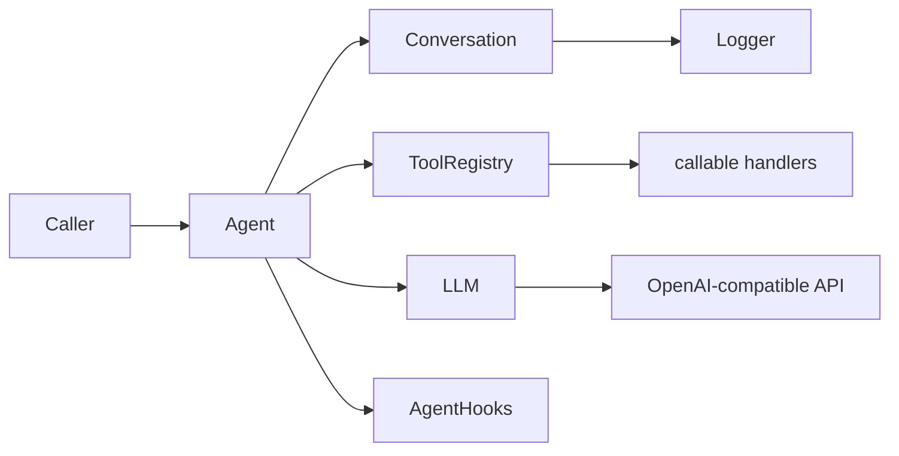

# llm-lib

PHP library for building **LLM agents** against **OpenAI-compatible** chat completion APIs (OpenAI, Ollama, vLLM, LiteLLM, etc.).

**Namespace:** `Tivins\LlmLib`  
**Package:** `tivins/llm-lib`  
**PHP:** `^8.3`  
**Current version:** see [`composer.json`](composer.json) and [`CHANGELOG.md`](CHANGELOG.md)

---

## Table of contents

1. [What this library does](#what-this-library-does)
2. [Architecture](#architecture)
3. [Quick start](#quick-start)
4. [Core concepts](#core-concepts)
5. [Agent lifecycle hooks](#agent-lifecycle-hooks)
6. [Behavioral contracts](#behavioral-contracts)
7. [Project layout](#project-layout)
8. [Development](#development)

---

## What this library does

| Responsibility | Class | File |
|---|---|---|
| HTTP client for `/v1/chat/completions` | `LLM` | `src/LLM.php` |
| Message history | `Conversation` | `src/Conversation.php` |
| Single turn: LLM ↔ tools loop | `Agent` | `src/Agent.php` |
| Tool definitions + handlers | `ToolRegistry`, `Tool`, `ToolSchema` | `src/ToolRegistry.php`, … |
| Request parameters | `ChatCompletionOptions` | `src/ChatCompletionOptions.php` |
| Turn outcome | `AgentTurnResult` | `src/AgentTurnResult.php` |
| Optional JSON persistence | `Logger` | `src/Logger.php` |
| Observability / extension points | `AgentHooks` | `src/AgentHooks.php` |

**Not included:** streaming, embeddings, model management endpoints (stubs exist as comments in `LLM.php`), multi-agent orchestration, or a built-in chat UI.

---

## Architecture



**One agent turn** (`Agent::runTurn()`):

1. Dispatch `BeforeTurn`.
2. Call the LLM with the current conversation.
3. If the assistant message contains `tool_calls`, execute each tool, append tool messages, and call the LLM again.
4. Repeat until the model stops with `finish_reason: stop` (or `length` without tool calls — see [behavioral contracts](#behavioral-contracts)).
5. Store the final assistant message in the conversation.
6. Dispatch `AfterTurn` and return `AgentTurnResult`.

---

## Quick start

### Install

```bash
composer require tivins/llm-lib
```

### Minimal agent (text response)

```php
<?php

use Tivins\LlmLib\Agent;
use Tivins\LlmLib\ChatCompletionOptions;
use Tivins\LlmLib\Conversation;
use Tivins\LlmLib\LLM;
use Tivins\LlmLib\Message;
use Tivins\LlmLib\Role;
use Tivins\LlmLib\ToolRegistry;

$llm = new LLM(
    endpoint: 'http://localhost:11434',  // Ollama example
    defaultModel: 'llama3',
);

$tools = new ToolRegistry();
$agent = new Agent($llm, $tools);

$conversation = new Conversation([
    Message::withCreatedAt(Role::User, 'Hello!'),
]);

$result = $agent->runTurn($conversation, new ChatCompletionOptions(temperature: 0.3));

if ($result->success) {
    echo $result->message->content;
} else {
    echo 'Error: ' . $result->error;
}
```

### Agent with tools

```php
use Tivins\LlmLib\Tool;
use Tivins\LlmLib\ToolSchema;

$tools = new ToolRegistry(
    new Tool(
        new ToolSchema(
            name: 'get_weather',
            description: 'Get current weather for a city',
            parameters: [
                'type' => 'object',
                'properties' => [
                    'city' => ['type' => 'string'],
                ],
                'required' => ['city'],
            ],
        ),
        handler: fn (string $args): string => json_encode(['temp_c' => 22, 'city' => json_decode($args, true)['city'] ?? 'unknown']),
    ),
);

$agent = new Agent($llm, $tools, maxToolRounds: 10);
```

Handlers receive the **raw JSON arguments string** from the model and must return a **string** (usually JSON) used as the tool message `content`.

### Conversation logging

```php
use Tivins\LlmLib\Logger;

$conversation = new Conversation(
    messages: [],
    logger: new Logger('/var/log/conversations/session-1.json'),
);
// Each addMessage() (including those done by Agent) triggers a file write.
```

---

## Core concepts

### `Message`

A chat message with `role`, `content`, optional `reasoningContent`, `toolCalls`, `toolCallId`, and `meta`.

Two serialization methods exist on purpose:

| Method | Purpose |
|---|---|
| `toArray()` | Internal storage, logs, `JsonSerializable` — keeps `reasoning_content` and `meta` |
| `toChatCompletionArray()` | Payload sent to the API — omits `reasoning_content` and `meta` |

### `Conversation`

Ordered list of `Message` objects. `toChatCompletionArray()` maps every message through `Message::toChatCompletionArray()`.

### `ChatCompletionOptions`

Per-request settings: `model`, `temperature`, `topP`, `n`, `tools`, `toolChoice`, `responseFormat`.

**Important:** `Agent::runTurn()` **injects** `$options->tools = $this->tools` (mutates the object in place). Passing a different `ToolRegistry` in options throws `InvalidArgumentException`.

### `AgentTurnResult`

```php
new AgentTurnResult(
    message: ?Message,   // final assistant message when success
    success: bool,
    error: ?string,
    toolRounds: int,       // number of tool execution rounds in this turn
);
```

### `LLM`

- Endpoint base URL (no trailing `/v1`); requests go to `{endpoint}/v1/chat/completions`.
- Optional `apiKey` → `Authorization: Bearer` header.
- Throws `Exception` on cURL failure, HTTP ≥ 400, or malformed JSON.

### `ToolRegistry`

- `registerTools()` adds or **overwrites** tools by name (last registration wins).
- `execute()` runs the handler or returns a tool message with `{"error":"No handler for tool: …"}` (no exception).

---

## Agent lifecycle hooks

Register listeners on `AgentHooks` (fluent API). Events are defined in `AgentHookEvent`:

| Event | When | Notable payload |
|---|---|---|
| `BeforeTurn` | Start of `runTurn()` | `BeforeTurnEvent` |
| `AfterTurn` | End of `runTurn()` | `AfterTurnEvent` + `AgentTurnResult` |
| `BeforeLlmCall` / `AfterLlmCall` | Around each API call | `toolRound` index |
| `BeforeToolRound` / `AfterToolRound` | Around each batch of tool executions | tool calls / tool messages |
| `BeforeToolCall` / `AfterToolCall` | Per tool call | `BeforeToolCallEvent::$replacement` can skip execution |
| `OnMaxToolRoundsExceeded` | `maxToolRounds` reached | turn fails after this |
| `OnAssistantResponse` | Before storing final assistant message | `OnAssistantResponseEvent::$visibleContent` can rewrite content |

```php
$hooks = new AgentHooks();
$hooks->beforeToolCall(function (BeforeToolCallEvent $event): void {
    // Return a canned tool message without calling the handler:
    // $event->replacement = new Message(Role::Tool, '{"mock":true}', toolCallId: $event->call->id);
});

$agent = new Agent($llm, $tools, hooks: $hooks);
```

---

## Behavioral contracts

These behaviors are **intentional** and covered by unit tests. Open questions live in [`TODO.md`](TODO.md).

### Empty content

- Stored as `''` in `Message::$content` and `toArray()`.
- Sent to the API as `null` in `toChatCompletionArray()` (OpenAI format).

### `reasoning_content`

- Parsed from API responses and kept in `Message::$reasoningContent`.
- Included in `toArray()` for logging.
- **Never** sent back in subsequent requests via `toChatCompletionArray()`.

### Unknown tool

No handler → tool message with JSON error content; conversation continues (model may recover).

### Duplicate tool name

`registerTools()` silently overwrites the previous handler for the same name.

### `finish_reason: length`

If the model stops due to token limit **without** pending tool calls, the turn is treated as **success** (truncated content is stored). Check `message->meta['finish_reason']` if you need to detect truncation.

### Assistant message metadata

Stored assistant messages include `meta` with at least `created_at`, `time_ms`, `model`, `usage`, `finish_reason`, and `temperature` (from options).

---

## Project layout

```
src/
  Agent.php              # Turn orchestration
  AgentHooks.php         # Hook registry
  AgentHookEvent.php     # Hook event enum
  AgentTurnResult.php
  ChatCompletionOptions.php
  ChatCompletionResponse.php
  Choice.php
  Conversation.php
  Hooks/                 # Typed event payload classes
  LLM.php                # HTTP client
  Logger.php
  Message.php
  Role.php
  Tool.php
  ToolCall.php
  ToolRegistry.php
  ToolSchema.php
  Usage.php
tests/                   # PHPUnit tests (behavioral contracts)
TODO.md                  # Behaviors under review
```

---

## Development

```bash
composer install
composer test          # PHPUnit
composer analyse       # PHP CS Fixer (dry-run) + PHPStan
composer cs-fix        # Auto-fix code style
```

### Extending `LLM`

The library uses a concrete `LLM` class (not an interface). For tests or custom transports, substitute any object with a compatible `chatCompletion(Conversation, ChatCompletionOptions): ChatCompletionResponse` method — see `tests/Support/StubLLM.php`.

### Contributing

1. Add or update tests for behavior changes.
2. Run `composer analyse` and `composer test`.
3. Document intentional behavior in this README or [`TODO.md`](TODO.md).
4. Update [`CHANGELOG.md`](CHANGELOG.md) under `[Unreleased]`.

---

## License

MIT — see [`composer.json`](composer.json).
